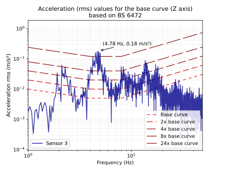
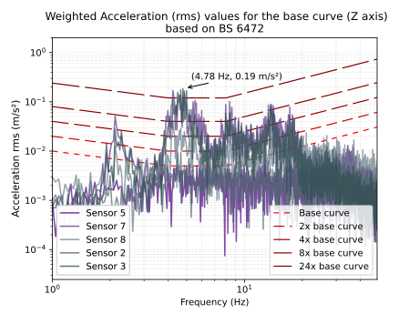

## BS 6472

Serviceability assessment as per BS 6472 for human exposure to vibration in buildings Vibration sources other than blasting


## How to use it 

Import  the Service_assessment class and pass the accelerarion data (NDArray), sampling frequency (float), activaty factor based on BS6472 guidelines, and rms

# Example Single Meassurement

```python 
    
    from bs_6473 import Service_assessment


    class VibrationTest(BaseModel):
        name: str
        fs: float
        Acc_x: Any
        Acc_y: Any
        Acc_z: Any

        def set_accelerations(self, axis: Literal['Acc_x', 'Acc_y', 'Acc_z'], data: np.ndarray):
            setattr(self, axis, data)


    class VibrationSurvey(BaseModel):
        list_of_tests: List[VibrationTest]
        
        def append(self, test: VibrationTest):
            self.list_of_tests.append(test)

        def get_axis_data(self, axis: Literal['Acc_x', 'Acc_y', 'Acc_z']) -> List[np.ndarray]:
            return [getattr(test, axis) for test in self.list_of_tests]


    # Process the data: and slice the evet : [39600:42000]
    acc_data = vibration_survey.list_of_tests[5].Acc_z[39600:42000]*9.81
    fs = vibration_survey.list_of_tests[5].fs
    _dir = 'Z'
    service_assessment = Service_assessment(acc_data, fs, _dir,0.18)
    
    # Curve factor as per BS 6472
    curve_factors = [1,2,4,8,24]
    labels = [f"{factor}x base curve" for factor in curve_factors]
    labels[0] = 'Base curve'
    
    # Assessment plot
    service_assessment.BS_6472(act_fact=[1,2,4,8,24], labels=labels, tooltip=True , sensor_names=['Sensor 3'])
```

## Example Multiple Measurements 
``` python 
    # Vibration_survey_align_z: VibrationSurvey
    acc_z = vibration_survey_align_z.get_axis_data('Acc_z')
    acc_z_ms = acc_z
    acc_z_ms = [slice_array(acc,29600,32000) for acc in acc_z]
    rms_acc_z = [calculate_rms(acc) for acc in acc_z_ms]
    max_index = np.argmax(rms_acc_z)

    # Tooltip asignation to the max rms value
    bool_list = [False] * len(data)
    bool_list[max_index] = True

    _dir = 'Z'
    service_assessment = Service_assessment(acc_data=acc_z_ms, 
                                            fs=fs, 
                                            _dir = _dir,
                                            rms_fix= rms_acc_z)
    
    # Curve factor as per BS 6472
    curve_factors = [1,2,4,8,24]
    labels = [f"{factor}x base curve" for factor in curve_factors]
    labels[0] = 'Base curve'
    
    # Assessment plot
    service_assessment.BS_6472(act_fact=[1,2,4,8,24], labels=labels,tooltip=bool_list,sensor_names=names)

```



# Install
```sh
pip install -r requirements.txt
```
